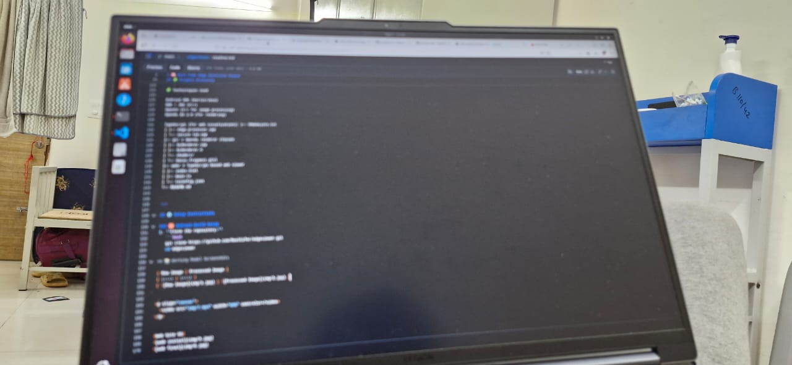
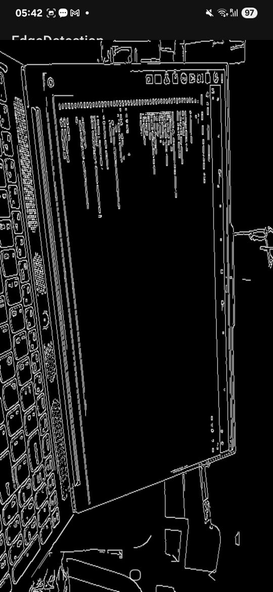
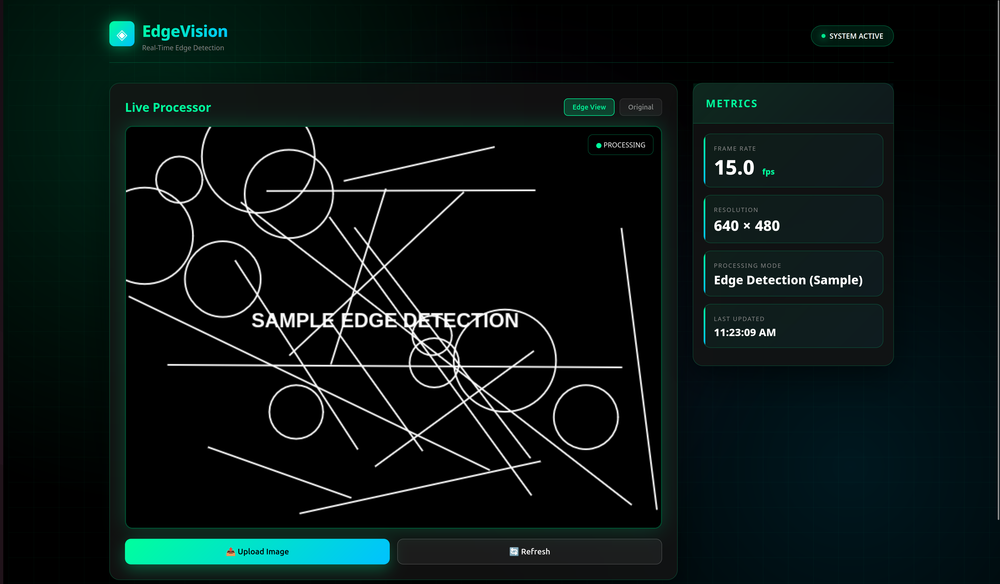
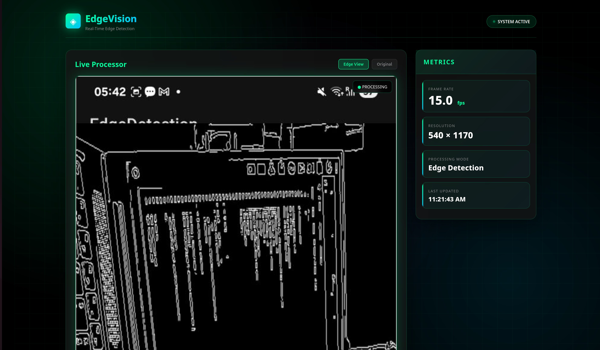

# 🧠 Real-Time Edge Detection Viewer  
**Tech Stack:** Android + OpenCV (C++) + OpenGL ES + TypeScript (Web Viewer)

A real-time edge detection system that captures live camera frames, processes them through **OpenCV in C++ via JNI**, and renders the output using **OpenGL ES 2.0**. Additionally, a lightweight **TypeScript web viewer** displays a sample processed frame, demonstrating seamless integration between native Android image processing and web visualization.

---

## 🚀 Key Features  

### 📱 Android Application  
- **Live Camera Feed** using the Camera2 API (`TextureView`).  
- **JNI-based Frame Processing** — frames are transferred to native C++ for processing.  
- **OpenCV-based Canny Edge Detection and Grayscale Filters** implemented in C++.  
- **OpenGL ES Renderer** to visualize processed frames in real time.  
- Achieves smooth **10–20 FPS** during processing and rendering.  
- **Toggle Button** to switch between raw and edge-detected views.  
- **FPS Counter** overlay for real-time performance tracking.  

### 🌐 TypeScript Web Viewer  
- Simple **TypeScript + HTML** web app displaying a **sample processed frame** (static/base64).  
- Displays frame metadata — FPS, resolution, and processing time.  
- Demonstrates how native-processed outputs can be visualized in a browser-based interface.  

---

## 🧩 Project Structure  

📦 RealTime-EdgeDetection
├── app/ # Android (Kotlin/Java)
│ ├── MainActivity.kt
│ ├── CameraHandler.kt
│ └── JNIInterface.kt
│
├── jni/ # Native C++ (OpenCV)
│ ├── CMakeLists.txt
│ ├── edge_processor.cpp
│ └── native-lib.cpp
│
├── gl/ # OpenGL Renderer
│ ├── GLRenderer.cpp
│ ├── GLRenderer.h
│ └── shaders/
│ └── basic_fragment.glsl
│
├── web/ # TypeScript Web Viewer
│ ├── index.html
│ ├── main.ts
│ └── tsconfig.json
│
└── README.md


---

## ⚙️ Setup Instructions  

1. **Clone the repository:**  
   ```bash
   git clone https://github.com/RealCifer/edgeviewer.git
   cd edgeviewer
   ```
### 1. Open the Project  
- Launch **Android Studio (Hedgehog or newer)**  
- Go to **File → Open** and select the project folder  
- Wait for Gradle to sync  

---

### 2. Install Required SDK Tools  
- Go to **Tools → SDK Manager → SDK Tools** tab  
- Enable and install:
  - ✅ **NDK (Side by Side)**  
  - ✅ **CMake**  
  - ✅ **LLDB** *(optional for native debugging)*  

---

### 3. Link OpenCV SDK  
- Visit the [OpenCV Releases Page](https://opencv.org/releases/)  
- Download and extract the **OpenCV Android SDK (ZIP)**  
  (e.g., `C:/OpenCV-android-sdk/`)  

- Update your `CMakeLists.txt`:
  ```cmake
  set(OpenCV_DIR "C:/OpenCV-android-sdk/sdk/native/jni")
  find_package(OpenCV REQUIRED)
  include_directories(${OpenCV_INCLUDE_DIRS})
  target_link_libraries(native-lib ${OpenCV_LIBS} log)


bash```
externalNativeBuild {
    cmake {
        path "src/main/cpp/CMakeLists.txt"
    }
}

```


4. Run the App

Connect your Android device or start an emulator

Press ▶️ Run in Android Studio

Observe the real-time edge-detected camera feed in action

</details>

<details> <summary>💻 Web Viewer Setup</summary>
1. Install Dependencies

bash ```
cd web
npm install typescript
tsc

```


2. Launch the Viewer

Open index.html in your browser to view:

A static base64-encoded processed frame

Frame metadata such as FPS, resolution, and processing time

</details>


🧠 Architecture Overview

Camera Feed (Java/Kotlin)
     ↓
JNI Bridge
     ↓
Native Processing (C++ / OpenCV)
     ↓
OpenGL ES Renderer
     ↓
Real-Time Display
     ↓
Web Layer (TypeScript)


🔄 Data Flow

Camera Frame → JNI Bridge → OpenCV (C++) → Processed Output → OpenGL Texture → Display → Web Viewer

🧩 Components

Camera Feed: Captured via Camera2 API

Native Processing: Canny Edge / Grayscale filters using OpenCV

Rendering: OpenGL ES 2.0 for real-time visualization

Web Visualization: Displays example processed output

🧰 Technologies Used

Android SDK (Kotlin/Java)

NDK + JNI (C++)

OpenCV (C++ for Image Processing)

OpenGL ES 2.0 (Rendering)

TypeScript + HTML (Web Visualization)


---


## 📸 Working Model Screenshots

| Raw Image | Processed Image |
| :---: | :---: |
|  |  |

## Website Preview

||
